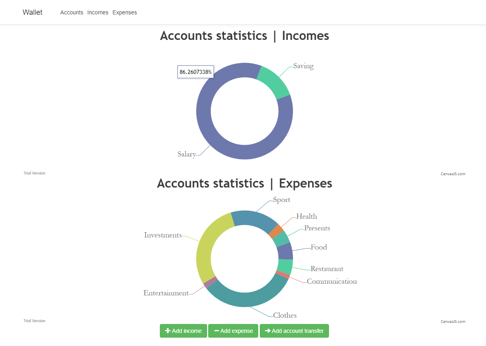

## Проектування Інформаційних Систем. Лабораторні роботи 6-8
***
### _Проект "Гаманець: керування власними фінансами"_

#### Технічні вимоги для запуску:
<li> Visual Studio 2017 or 2019
<li> Net core sdk version 3.0 or 3.1.
  
#### Інструкція для запуску
1. Завантажте проект до робочого простору.
2. Відкрийте файл _**.sln**_ за допомогою Visual Studio.
3. Після того, як проект успішно пройшов процесс "збірки" запустіть його натиснувши F5, або ж знайшовши на екрані кнопку "IIS Express".

#### Розгортання на сервісі
Перейти за посиланням: [Wallet Application](http://wallet20200108102709.azurewebsites.net)
